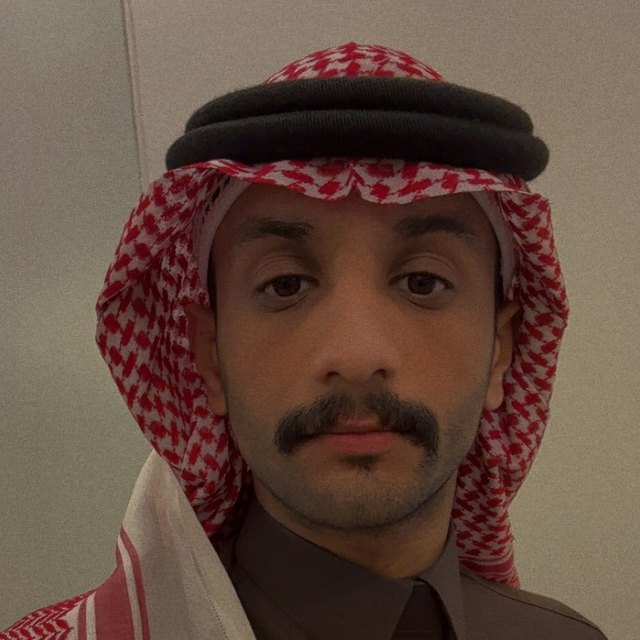

# Qasem Alolaywi — Portfolio

Personal portfolio site. A single self-contained `index.html` — no framework, no build step, no dependencies.

## Run it

Open `index.html` in a browser, or serve it locally:

```bash
python3 -m http.server 4000
# then open http://localhost:4000
```

## Structure

```
index.html    # the entire site: markup, styles and theme toggle
```

## Editing

**Add your photo.** The hero currently shows a "QA" monogram placeholder. Drop your
photo in this folder (e.g. `photo.jpg`) and replace the avatar block in `index.html`:

```html
<div class="avatar">
  
</div>
```

**Add a certification.** Copy any `.mini` block in the Education & Certifications
section and edit the title and meta line.

**Change colours.** Every colour is a CSS custom property defined at the top of the
`<style>` block — edit `--accent` and the rest follows. Light and dark palettes are
defined separately; the toggle in the nav persists the choice to `localStorage`.

## Publishing

The site is static, so it works on GitHub Pages, Netlify, Vercel or any static host.
For GitHub Pages: Settings → Pages → deploy from `main` / root. Note that Pages on a
**private** repository requires a paid GitHub plan; make the repo public first if you
want a free `github.io` URL.
